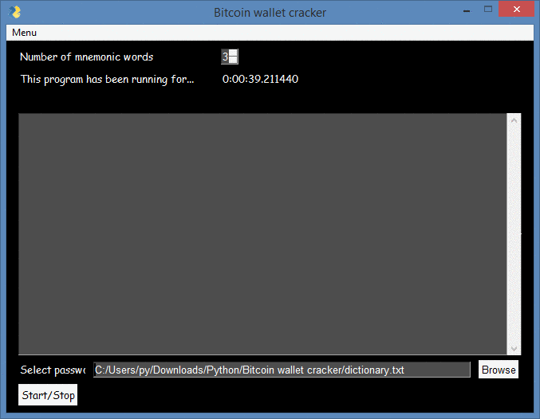

**Programmed in Python | PySimpleGUI**


[](https://www.python.org/)

[](https://github.com/adrijano/Bitcoin-wallet-cracker/)

[](https://github.com/adrijano/Bitcoin-wallet-cracker/graphs/commit-activity)


# Bitcoin wallet cracker
```
Automated Bitcoin wallet generator. With mnemonic and passphrases bruteforces wallet addresses.

```
# If you like it give it a star

[](https://github.com/adrijano/Bitcoin-wallet-cracker/)


[](https://www.paypal.com/donate/?cmd=_s-xclick&hosted_button_id=PFB6A6HLAQHC2&source=url)  [](https://commerce.coinbase.com/checkout/149a6235-ec7e-4d3b-a1ae-b08c4f08b4f6)


# Usage:
### Python3+

```
git clone https://github.com/adrijano/Bitcoin-wallet-cracker.git

cd Bitcoin-wallet-cracker && pip install -r requirements.txt

python bc.py

```
### Windows
```
cd dist
start bc.exe
```
# Proof of Concept
```
Although this project can be used maliciously, it is simply an 
exploration into the Bitcoin protocol and advanced encryption and 
hashing techniques using Python.
```


**Address with balance is saved in txt file**
```
address: 17wd8bTwMPYfbo6YwmTFU4xH4hDkd13ATZ
private key: 0651863bf5d902262b17c4621ec340544ff016752543d99a92d7d22872d8a455
WIF private key: 5Hs4yg5HYcAmS97UPgmj54V6Lvmv1yKf4yGWs4qcwkWjB5FFnaz
public key: 040577b1aa3256fed819174b1e6557d4b269f42e383df393b1e8a4c6b9d117994
bc476304738fb948cec05a5d17d0fe6f996e7ec0b4a8e2853e41d6657f3f41e33


address: 125Rs7DdFpNdZgxtPvsQXiM3MDsCEt6F49
private key: 177c1fdf54c4cb646e3425b7756f5c517c740bdc997b59c968e0a92a0b425f54
WIF private key: 5HzdUFvvYhiKw97xnZtv5eYWuHKQZ1GMWVChuzkxwuQvrzacPg5
public key: 04040e4311b932c26f2172e112d1e37bca43428ea6951e3269513ecff6dda67dd
8b39666ef34e1dfd82cfdc689d6099905ed9f291f4b4bdf921e81d1b657eee1e6
```

## Donations
If you would like to support me, donations are very welcome.

```
You can use Paypal to donate using your own credit card. 
The payment is processed by PayPal but you don't need to have a
PayPal account or sign-up for one if you are paying by credit card.

You can also use your own Paypal account to donate.

You can also donate Bitcoin, Bitcoin Cash, Dai, Ethereum, Litecoin and USD Coin.
```
[](https://www.paypal.com/donate/?cmd=_s-xclick&hosted_button_id=PFB6A6HLAQHC2&source=url)  [](https://commerce.coinbase.com/checkout/149a6235-ec7e-4d3b-a1ae-b08c4f08b4f6)

[](https://github.com/adrijano/Bitcoin-wallet-cracker/)


# Disclaimer


**The code within this repository comes with no guarantee, the use of this code is your responsibility. I take NO responsibility and/or liability for how you choose to use any of the source code available here. By using any of the files available in this repository, you understand that you are AGREEING TO USE AT YOUR OWN RISK. Once again, ALL files available here are for EDUCATION and/or RESEARCH purposes ONLY.**


